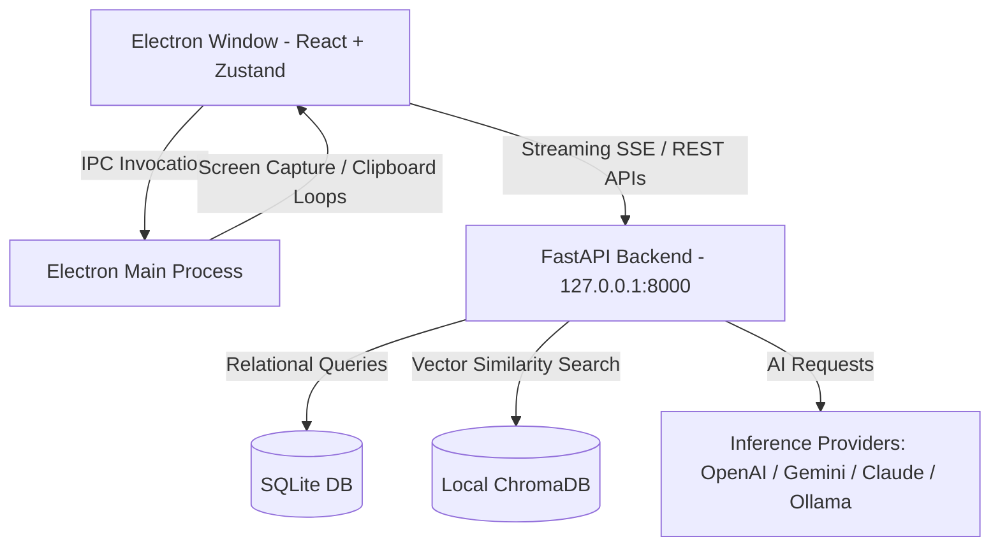

# Nexora AI – Intelligent Desktop Copilot

Nexora AI is a production-ready, local-first AI-powered desktop copilot designed for developers, students, researchers, and professionals. It provides AI chat, document intelligence (RAG), screenshot analysis, voice assistance, and markdown notes in a secure, glassmorphic dark mode user interface.

Designed around the principle of **ethical, user-controlled productivity**, Nexora AI only captures screenshots, watches the clipboard, or indexes documents when explicitly initiated by the user.

---

## 🛠️ Tech Stack

* **Frontend:** React 19, TypeScript, Tailwind CSS v4, Framer Motion, Zustand
* **Desktop Wrapper:** Electron (managing multi-window capturing, clipboard loops, and hotkeys)
* **Backend:** FastAPI (Python 3.12), REST API, Server-Sent Events (SSE) streaming, WebSockets
* **Databases:** SQLite (default SQLAlchemy declarative tables), ChromaDB (local persistent vector storage for RAG queries)

---

## 🚀 Key Features

1. **AI Chat:** SSE streaming completions with markdown support, code highlights, response copy, and unified switching between OpenAI, Gemini, Claude, and offline Ollama.
2. **Screenshot Analyzer:** Hotkey capturing (`Alt+Space` window toggle) or image upload. Extracts text via OCR and explains UI views, charts, and diagrams.
3. **Document Intelligence:** Ingests PDF, DOCX, TXT, and PPTX files. Text chunks are indexed locally in ChromaDB to enable vector search querying and study flashcard generation.
4. **Clipboard AI:** (Opt-in) Automatically monitors copy history and suggests quick presets (Summarize, Translate, Improve, Explain Code).
5. **Notes & Folders:** Compile markdown documents and knowledge bases. Side panel generates 3-bullet summaries via the active model.
6. **Workspace Hub:** Overview search library to track all notes, uploaded documents, and chat logs in a single desk.

---

## 🏗️ Architecture Design



---

## ⚙️ Installation & Setup

### Prerequisites
* **Node.js:** v22.x or above
* **Python:** v3.12.x or above

### 1. Auto-Installation
From the workspace root, run the combined setup command to install Node modules, establish the Python virtual environment (`venv`), and fetch packages:
```bash
npm install
npm run install:all
```

### 2. Configure Environment Variables (Optional)
You can create a `.env` file in the `backend/` directory:
```env
OPENAI_API_KEY=your-openai-api-key
GEMINI_API_KEY=your-gemini-api-key
ANTHROPIC_API_KEY=your-anthropic-api-key
OLLAMA_HOST=http://localhost:11434
```
*Note: Credentials can also be securely updated inside the App settings UI and saved in the SQLite table.*

### 3. Run Development Servers
Start both the React-Electron hot reload dev-server and the FastAPI backend concurrently:
```bash
npm run dev
```

---

## 🐳 Docker Deployment

To run Nexora AI as a web service:
```bash
docker-compose up --build
```
* Access the Vite React frontend at `http://localhost`
* Access the FastAPI swagger documentation at `http://localhost:8000/docs`

---

## 🧪 Unit Testing

Run the Python pytest suite:
```bash
# Set up venv and run:
.\venv\Scripts\pytest backend/tests/test_backend.py
```
